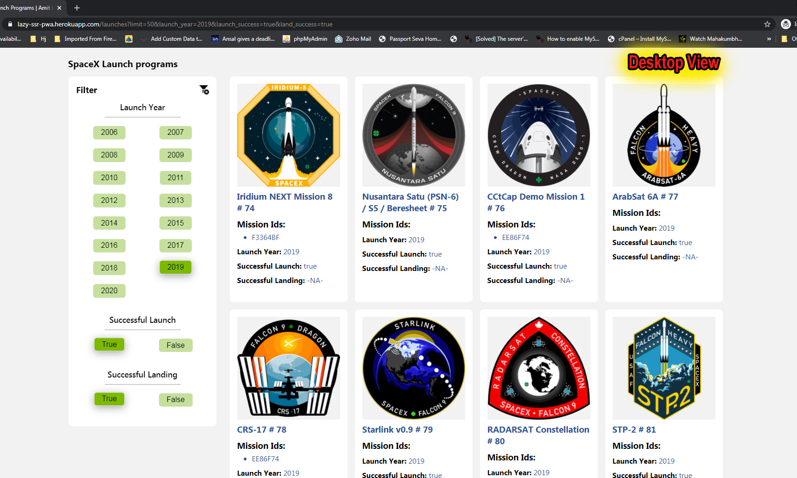
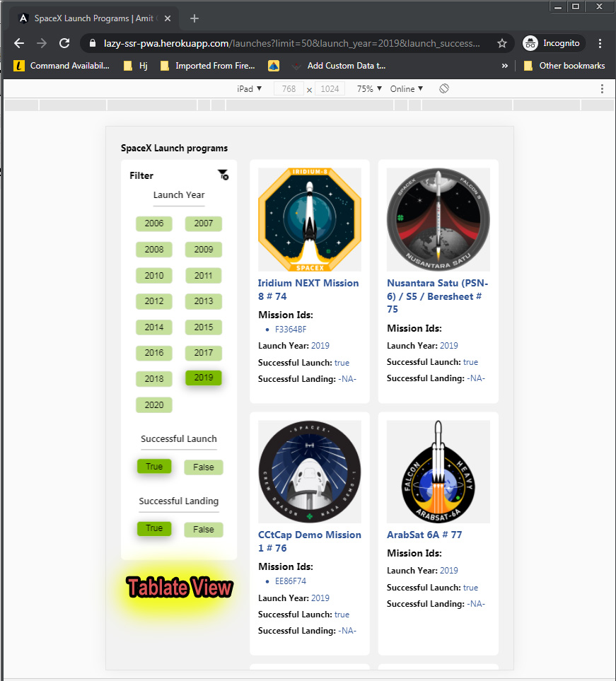
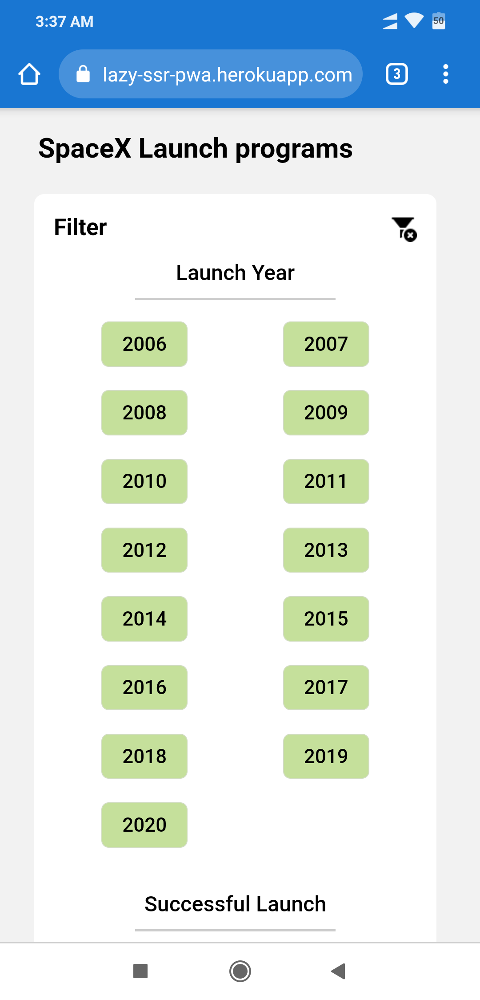
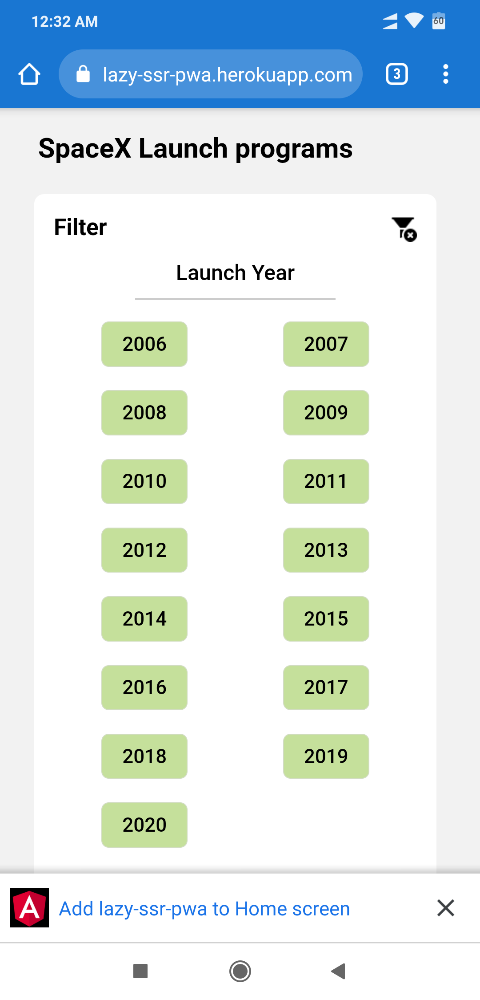
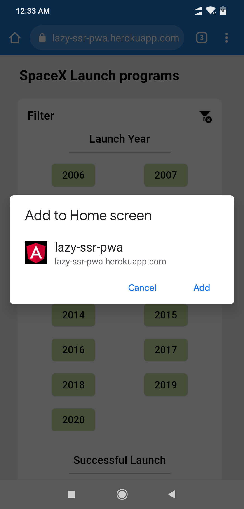
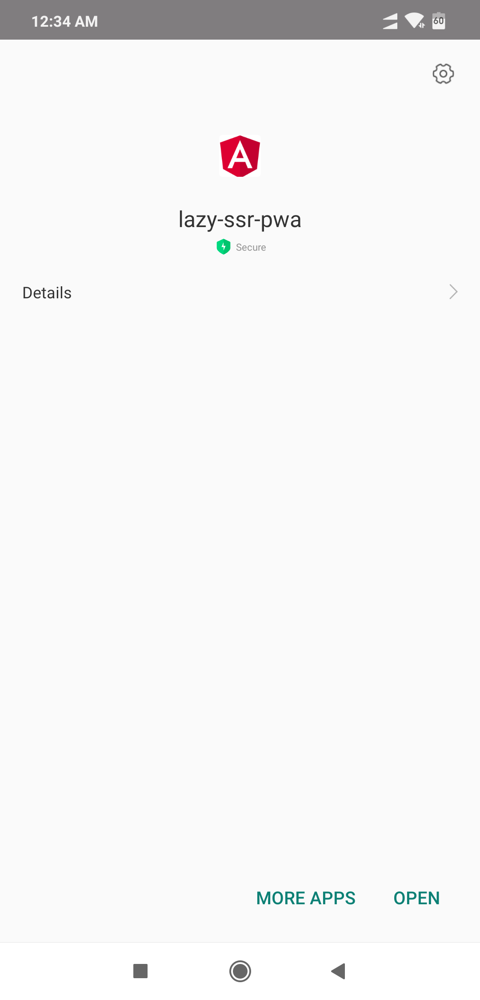
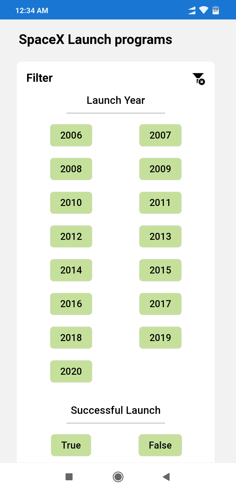
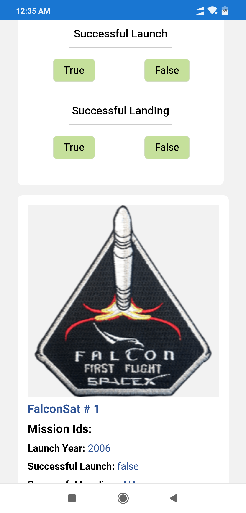

# Lazy SSR PWA (Angular 10)

> This project was generated with [Angular CLI](https://github.com/angular/angular-cli) version 10.1.1.
> Its Angular 10 front-end application with API call, Server side rendering (ssr), Lazy loading modules,Lazy load images and PWA Features.
> ### Live Demo URL : http://lazy-ssr-pwa.herokuapp.com
> **Note: all the output Screens are attached at buttom of this page.**

# Contents
1. [Lighthouse Audit](#lighthouse-audit)
1. [Technology stack](#technology-stack)
1. [Features](#features)
1. [Development and Production server](#development-server)
1. [Development and Production Builds](#Development-Build-without-SSR) 
4. [Compilation (tests)](#Compilation)
5. [Outputs](#OUTPUT)
   - [Server Side Rendering (SSR)](#OUTPUT)
   - [Lazy Loading (Working for Images)](#lazy-loading-working-for-images)
   - [Lazy Loading (Working for Modules)](#lazy-loading-working-for-child-modules)
   - [Responsive Layouts](#responsive-layouts)
   - [PWA Results](#pwa)
5. [Author](#author)

## Lighthouse Audit

 
**1: Lighthouse Audit Summary -** fallow this link : https://github.com/luckyamit2011/angular10-lazy-ssr-pwa/blob/master/reference/LightHous%20Reportl-Summary-lazy-ssr-pwa.pdf

**2: Lighthouse Audit Full Report Summary -** fallow this link : https://github.com/luckyamit2011/angular10-lazy-ssr-pwa/blob/master/reference/LightHous%20Full%20Reportl-azy-ssr-pwa.pdf

## Technology stack
### All dependencies:
<code>
  
    "dependencies": {
    "@angular/animations": "~10.1.1",
    "@angular/common": "~10.1.1",
    "@angular/compiler": "~10.1.1",
    "@angular/core": "~10.1.1",
    "@angular/forms": "~10.1.1",
    "@angular/platform-browser": "~10.1.1",
    "@angular/platform-browser-dynamic": "~10.1.1",
    "@angular/platform-server": "~10.1.1",
    "@angular/router": "~10.1.1",
    "@angular/service-worker": "~10.1.1",
    "@nguniversal/express-engine": "^10.1.0",
    "@nguniversal/module-map-ngfactory-loader": "^8.2.6",
    "express": "^4.15.2",
    "ng-lazyload-image": "^9.0.1",
    "rxjs": "~6.6.0",
    "tslib": "^2.0.0",
    "zone.js": "~0.10.2"
    }  
</code>

## Features
- Lazy Loading Images
- Lazy Loading Modules
- SSR
- PWA (App + Push Notfications)
- Responsive Layout

## Development server

**Without SSR  Run `ng serve` for a dev server. Navigate to `http://localhost:4200/`. The app will automatically reload if you change any of the source files.

**With SSR  Run `npm run serve:ssr` for a dev server. Navigate to `http://localhost:4200/`. The app will automatically reload if you change any of the source files.

## Code scaffolding

Run `ng generate component component-name` to generate a new component. You can also use `ng generate directive|pipe|service|class|guard|interface|enum|module`.

## Development Build without SSR

Run `ng build` to build the project. The build artifacts will be stored in the `dist/` directory. Use the `--prod` flag for a production build.

## Development Build with SSR

Run `npm run dev:ssr` to build the project for production. The development build artifacts will be stored in the `dist/` directory. It will will generate one more server folder for SSR.

## Production Build with SSR

Run `npm run build:ssr` to build the project for production. The production build will be generate most compressed code for your project for finale production and will be stored in the `dist/` directory same like development build but in most compressed form.
for a Production server Navigate to `http://localhost:4000/`. 

## Compilation

## Running unit tests

Run `ng test` to execute the unit tests via [Karma](https://karma-runner.github.io).

### Output after doing Unit Testing

## Running end-to-end tests

Run `ng e2e` to execute the end-to-end tests via [Protractor](http://www.protractortest.org/).

# ****OUTPUT******

## Server Side Rendering (SSR)

## URL for page source : `view-source:http://lazy-ssr-pwa.herokuapp.com/launches?limit=50`  //--> copy full link start from "view-source.......=50"

Server-side rendering can bring several benefits to performance and SEO. as you can see in below out put when we check page source its showing all the html contend/ page data so browser is now able to view page data. 

some time ssr is not working well when you check again and again view shoure.

If you unable to see data in page source, just fallow below given instructions:

1: you can directly use this link : 'view-source:http://lazy-ssr-pwa.herokuapp.com/launches?limit=50' and check

2: Try to check in browser Incognito mode

3: Try to check in different browser

4: try to disable your browser adons

## Lazy Loading (Working for Images)
Images is start loading lazily so it's requiring a user to scroll in order to view them.as you can see in belo output screen:

## Lazy Loading (Working for Child Modules)

## Responsive Layouts:
<table>
  <tr>
    <td>
      
       ### Desktop View
    </td>
     <td>
      
      < ### Tablate View
    </td>
     <td>
      
       ### Mobile View
    </td>
  </tr> 
</table> 

## PWA:

<table>
  <tr>
    <td>
      
       1 Notification at bottom
    </td>
     <td>
      
       2 instalation popup
    </td>
     <td>
      
       3 instalation progress...
    </td>
    <td>
      
       4 PWA App First Look
    </td>
    <td>
      
       5 PWA After Scroll Look
    </td>
  </tr> 
</table> 

## Further help

To get more help on the Angular CLI use `ng help` or go check out the [Angular CLI README](https://github.com/angular/angular-cli/blob/master/README.md).

## Author

- Updated : 17/Sep/2020
- Author : Amit Gupta
- Email : contact@amitkg.me
- Portfolio : https://www.amitkg.me
